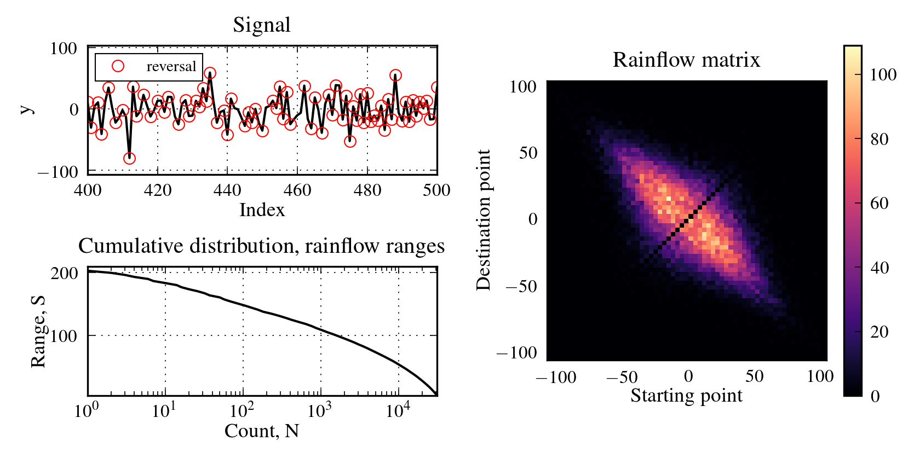

# FatPACK

Package for fatigue analysis (FatPACK).

## Table of Contents

- [Installation](#installation)
- [Usage](#usage)
- [Support](#support)
- [Contributing](#contributing)

## Installation

Download the repository to your computer and install the package with the setup.py file. For instance, create a wheel and install by pip:
	
    python setup.py bdist_wheel -d dist
    pip install dist/fatpack-X.Y.Z

## Usage

The package includes modules for:

- Rainflow counting

An example is included (example.py) which extracts rainflow cycles and plots the figure presented below. The example is a good place to start to get into the use of the package.

## Support

Please [open an issue](https://github.com/Gunnstein/FatPACK/issues/new) for support.

## Contributing

Please contribute using [Github Flow](https://guides.github.com/introduction/flow/). Create a branch, add commits, and [open a pull request](https://github.com/Gunnstein/FatPACK/compare/).
